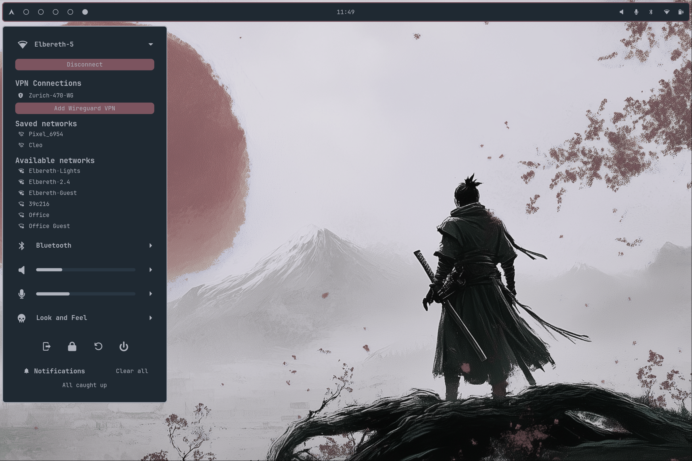

# OkPanel

# debugging
`cd OkPanel`
`~/.local/bin/okpanel quit`
`ags run --gtk=4 -d ./ags/`

A panel for Hyprland, built on AGS/Astal

## [Check out the docs to get started](https://johnoberhauser.github.io/OkPanel/)

