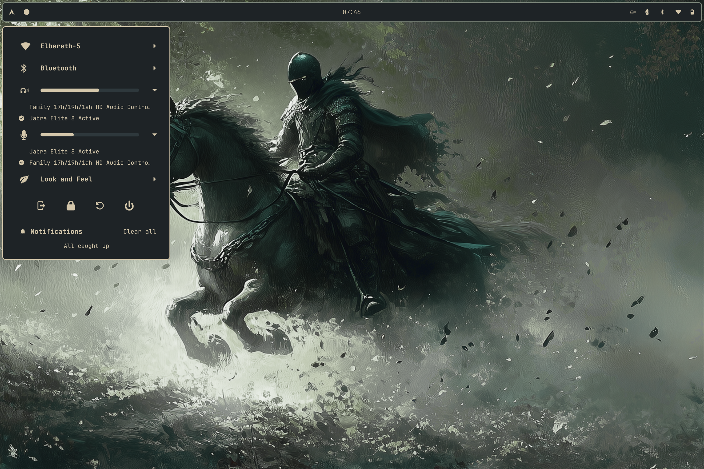

# Features

## Bar

Bars can be configured with varius widgets.  The position of the bar can be changed through the system menu Look and Feel controls

  
  

  
  

## System Menu

### Network management

In the network section you can connect and disconnect from Wi-Fi and VPNs.  For a VPN connection to show up
it must be added to network manager.  Wireguard and OpenVPN connections will show.

### Bluetooth device management

Scan and connect to bluetooth devices.

### Audio controls

In the audio section you can adjust the volume sliders or click the icon button to mute.
You can swap the default input/output.

### Look and Feel controls for theme, bar position, and wallpaper

Here you can switch between predefined themes.  The `themeUpdateScript` will be called
when switching themes.  The theme name you defined will be the first argument passed to the script.

You can switch the bar position here.

You can choose your wallpaper.  The wallpapers listed here are the ones found in the
directory defined in the theme's config.  JPG and PNGs in that directory will show up.
When selecting a wallpaper, the `wallpaperUpdateScript` will be called with the wallpaper
path as the argument.  That update script is in charge of setting the wallpaper with whatever
wallpaper program you use.

OkPanel will remember which wallpaper you last selected for each configured theme.  When
switching themes, the `wallpaperUpdateScript` will be called as well.

### Mpris media controls

Mpris controls will show up when available.

### Notification popups and history

To enter "Do not disturb" mode, click the notification bell icon.

### Screenshot and screen recording tool

The `okpanel screenshot` command must be key-bound for this to show up.

When screen recording, you can set your encoding speed and CRF.  CRF will impact
quality and file size.  Choose a higher number (further down the list) for a lower
quality and smaller file size.

### App launcher

The `okpanel launcher` command must be key-bound for this to show up.

### Calendar

Click the Clock widget in the bar to show the calendar.

### Volume and brightness alerts

These alerts will show automatically when changing volume or brightness.

### Screen share portal

The screen share portal only works with Hyprland's XDPH.  See the usage page for more info.

